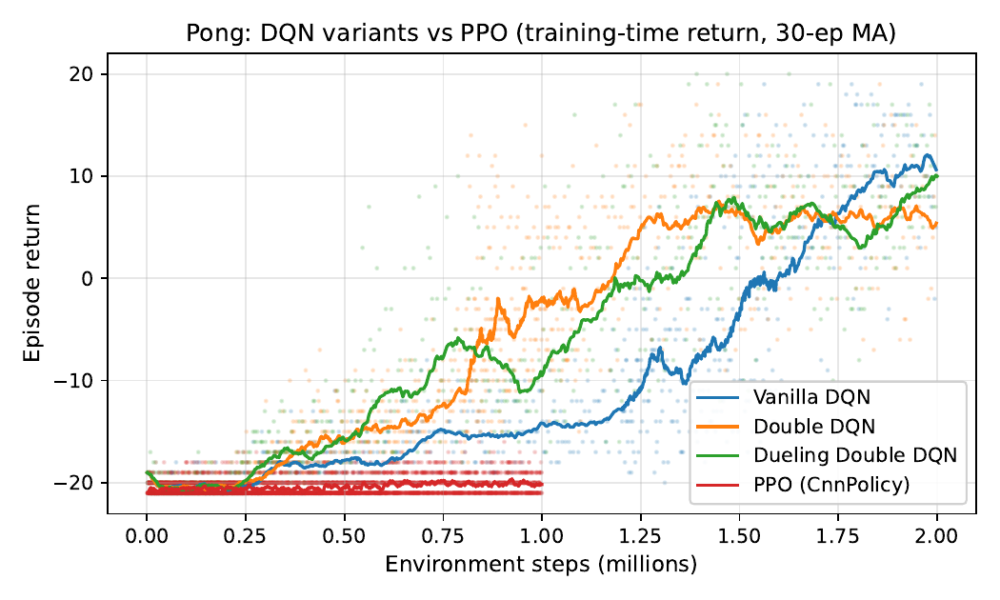
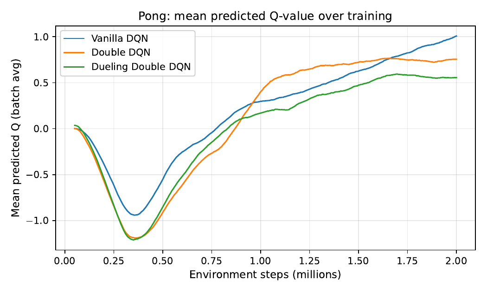
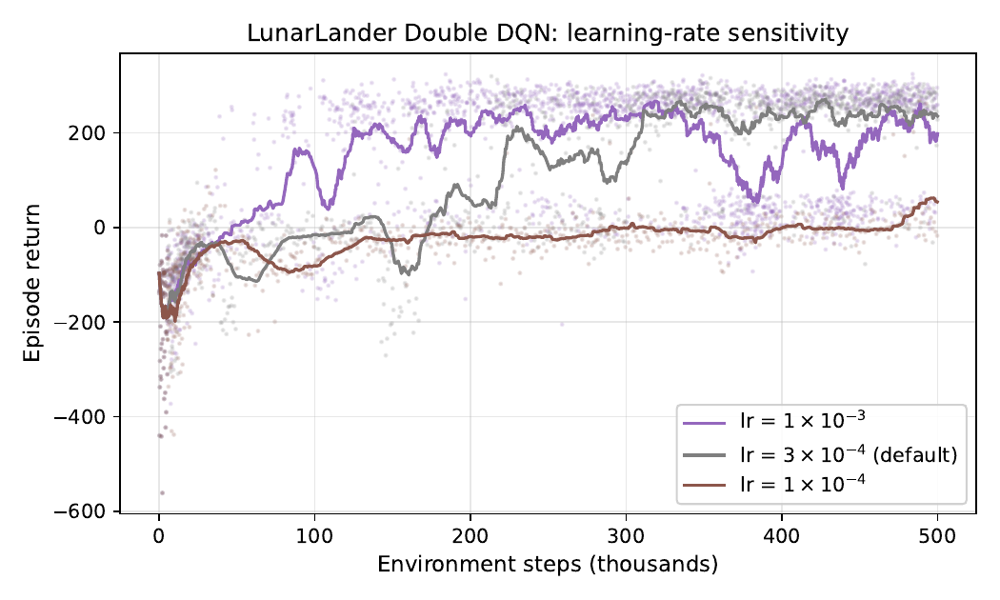
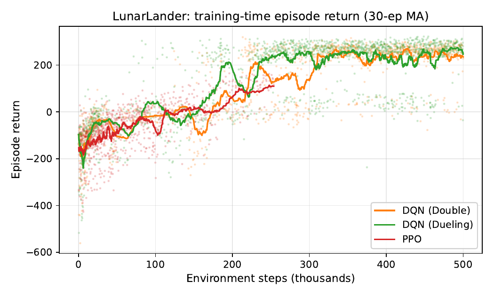

# AI HW3 — Comparing DQN Variants and PPO on Pong and LunarLander

NYCU Artificial Intelligence Spring 2026, Project #3. Reinforcement
learning study comparing three DQN variants (Vanilla, Double, Dueling
Double) and PPO across two Gymnasium environments.

## Research questions

1. **RQ1.** On Pong (Atari), how do Vanilla / Double / Dueling Double
   DQN differ in learning speed, final return, and Q-value calibration?
2. **RQ2.** On a different domain (LunarLander, low-dim Box2D, dense
   shaped reward), is off-policy value-based learning or on-policy
   policy-gradient learning preferable? Compare wall-clock, sample
   efficiency, and final score. PPO is then also run on Pong at the
   same 1 M-step budget to test whether the gap generalises to Atari.
3. **RQ3.** How sensitive are the resulting agents to a single
   high-impact hyperparameter — the Adam learning rate?

## Headline findings

### RQ2 — On-policy without replay buffer is sample-inefficient by an order of magnitude on Atari



At a matched 1 M env-step budget, PPO is essentially still at random
play on Pong (best 100-ep moving-average return $\approx -19.9$;
final 10-ep eval $-20.7 \pm 0.6$), whereas Double and Dueling DQN
have already crossed zero. PPO Atari needs $\gtrsim 5\times 10^{6}$
timesteps to converge with this configuration.

### RQ1 — Vanilla DQN's overestimation is visible in the Q-value curve



Vanilla DQN's batch-average $\overline{Q}$ climbs noticeably higher
than Double and Dueling Double DQN, exactly the over-estimation bias
predicted by Thrun & Schwartz (1993) — Double DQN's decoupled
action-selection / action-evaluation suppresses it.

### RQ3 — Hyperparameter dominates algorithm



A factor-of-10 LR change on LunarLander moves the final score by more
than the entire Vanilla → Double DQN improvement. Algorithmic
comparison without hyperparameter control is unreliable, consistent
with the wider deep-RL reproducibility literature.

### Bonus — DQN handily solves LunarLander; PPO climbs slowly within the same budget



Both DQN variants (Double / Dueling Double) cross the `+200` "solved"
threshold within $\sim 200$ K env-steps; PPO is still climbing past
zero at its $250$ K-step snapshot. The replay buffer's per-transition
reuse is the obvious contributor.

### Multi-seed robustness (Pong, 3 seeds; best 100-ep MA)

| Variant            | Mean | 95 % bootstrap CI  |
| ------------------ | ---: | ------------------ |
| Vanilla DQN        | −3.5 | [−13.0, +9.7]      |
| Double DQN         |  3.0 | [−5.6, +8.2]       |
| Dueling Double DQN |  5.6 | **[+4.6, +6.8]**   |

Only Dueling Double DQN's CI is strictly positive at this budget —
Vanilla and Double straddle zero. Dueling's empirical win on Pong is
therefore *both reproducibility and mean score*.

## Layout

```
.
├── code/
│   ├── train_dqn.py            # DQN training loop (Vanilla / Double / Dueling)
│   ├── train_ppo.py            # PPO training (MLP for LunarLander, CNN for Pong)
│   ├── networks.py             # CNN/MLP/dueling architectures
│   ├── wrappers.py             # Atari preprocessing
│   ├── replay_buffer.py        # Uniform experience replay
│   ├── dqn_agent.py            # DQN agent (3 variants)
│   ├── evaluate*.py            # 100-episode greedy evaluation
│   ├── plot_results.py         # Curves and Q-value plots
│   ├── make_tables.py          # Result tables (LaTeX)
│   ├── make_multiseed_combined.py  # Multi-seed table with bootstrap CIs
│   ├── render_gameplay.py      # Gameplay frame strips
│   ├── run_*.sh                # Training orchestrators
│   └── make_zip.sh             # Bundle source for Overleaf
├── report/
│   ├── main.tex                # Report source
│   ├── main.pdf                # Compiled report (10-page body + appendix)
│   ├── references.bib
│   ├── figures/                # All plots used in the report
│   ├── tables/                 # LaTeX tables
│   └── code_listings/          # Snapshot of code listings included in the appendix
├── AI_HW3.pdf                  # Assignment specification
└── README.md
```

`results/` (model checkpoints, training histories, ~866 MB) and
`logs/` are not tracked — they can be regenerated by re-running
`bash code/run_pong_all.sh`, `bash code/run_lander_all.sh`, and the
auxiliary `bash code/run_multiseed.sh` / `bash code/run_extra_runs.sh`
scripts.

## Reproducing the main numbers

```bash
# 1. Pong DQN: three variants, seed=42, 2M steps each on cuda:0
bash code/run_pong_all.sh

# 2. LunarLander DQN + LR ablation
bash code/run_lander_all.sh

# 3. Multi-seed Pong/LunarLander (seeds 0 and 7)
bash code/run_multiseed.sh

# 4. PPO on Pong (1M steps, CPU — GPU stack is flaky, see report)
bash code/run_ppo_pong_cpu.sh

# 5. Rebuild figures and tables
python code/plot_results.py
python code/make_tables.py
python code/make_multiseed_combined.py

# 6. Compile report
cd report && latexmk -pdf main.tex
```

## Engineering note

The ALE / PyTorch / SB3 stack produced sporadic native crashes
(`SIGSEGV`, `SIGTRAP`, and occasionally `torch.AcceleratorError: CUDA
error: unknown`) on extended runs. SB3 PPO on Pong crashed at startup
in ~90% of GPU attempts on both `cuda:0` and `cuda:1`; switching to
`--device cpu` made the 1 M-step run reliable. DQN runs survive
crashes through a checkpoint-resume retry wrapper.

## Acknowledgements

Built on top of the Nature DQN paper, the Double and Dueling DQN
papers, and PPO. Implementations of DQN are original (PyTorch); PPO
uses Stable-Baselines3. Gymnasium and the Arcade Learning Environment
provide the environments.
